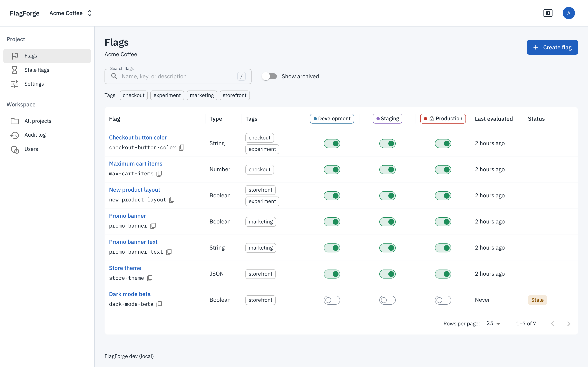
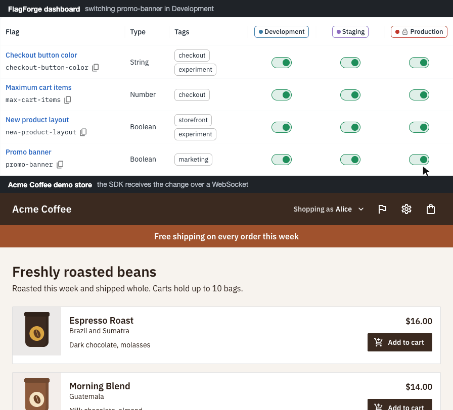
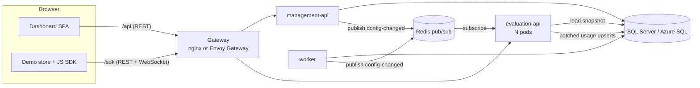

# FlagForge

**Self-hosted feature flags: change what your app does in about a second, without a deploy.**

[](https://github.com/OWNER/REPO/actions/workflows/ci.yml)
[](LICENSE)





<!--
To recapture the images, start the Compose stack from the quick start with a fresh database (`make down && make up`)
and sign in as the admin:
- dashboard.png: the Acme Coffee flag list (http://localhost:8080/projects/acme-coffee/flags) in a 1440x900 window.
- live-update.gif: record the flag list and the demo store (http://localhost:8080/demo/) while you switch promo-banner
  off and on in the Development column (Cmd+Shift+5 records the screen on macOS), then convert the recording:
  ffmpeg -i recording.mov -vf "fps=10,scale=900:-1:flags=lanczos,split[a][b];[a]palettegen[p];[b][p]paletteuse" docs/images/live-update.gif
-->

FlagForge is a complete feature-flag platform: a .NET 10 backend, a React dashboard, a JavaScript SDK with React
bindings, and a demo store that updates live. It runs with one command in Docker Compose, on a local Kubernetes cluster,
and on Azure (AKS) with CI/CD and a preview environment for every pull request.

## What it does

- **Flags with targeting.** Boolean, string, number, and JSON flags; per-environment on/off; individual targets; rules
  with conditions (`is one of`, `ends with`, `is at least`, `exists`, ...); and percentage rollouts that keep each
  user's variation stable as they grow.
- **Live updates.** Save a change and every connected app receives it over a WebSocket in under a second (0.3 to 0.7
  seconds from the click to the demo store changing, measured locally).
- **Safe changes.** A draft editor with a review diff, conflicts detected when two people edit the same flag, protected
  environments that need an admin and a comment, and a test panel that evaluates a draft before you save it.
- **Scheduling.** Schedule a change for later, or build a release plan (5%, 25%, 50%, 100% over three days) that the
  worker executes step by step.
- **Insight.** Evaluation counts per variation over time, stale-flag detection, and a searchable audit log with diffs.
- **Roles.** Viewers, Editors, and Admins, enforced by the API and reflected in the dashboard.

## Quick start

With Docker Desktop (on Apple silicon, turn on Rosetta emulation for SQL Server):

```sh
git clone https://github.com/OWNER/REPO.git flagforge && cd flagforge
docker compose up --build -d
open http://localhost:8080          # the dashboard; the demo store is at http://localhost:8080/demo/
```

No `.env` is needed: every setting has a development default. Sign in with the seeded accounts below.

| Account | Email | Password |
|---|---|---|
| Admin | `admin@flagforge.local` | `FlagForge!2026` |
| Editor | `editor@flagforge.local` | `FlagForge!2026` |
| Viewer | `viewer@flagforge.local` | `FlagForge!2026` |

These credentials, the demo SDK key (`ffk_local_demo_key_for_development_only_000`), and every other default are
**for local development only**. For your own values, run `scripts/gen-dev-secrets.sh`, which writes a `.env` with a
random signing key and SQL Server password.

`make up`, `make smoke`, and `make down` do the same with less typing (`make help` lists every target).

## Feature tour

1. **Flags** (`/projects/acme-coffee/flags`): the seeded "Acme Coffee" project has seven flags and an archived one.
   Each environment is a column of lamps; switching one in Production, a protected environment, asks you to type the
   flag key and give a reason.
2. **Targeting** (open a flag): add a rule such as "email ends with @acme.com", set the default rule to a 25/75
   rollout, click **Test flag** to evaluate a sample shopper against your draft, then **Review changes** and save.
3. **Demo store** (`/demo/`): switch between the shoppers Alice, Bob, and Carol, open the flag inspector, and change a
   flag in the dashboard's Development column (the environment the demo's SDK key belongs to). The banner, layout,
   cart limit, and colors update without a reload.
4. **Schedule** (a flag's Schedule tab): create a release plan and watch the worker apply its steps.
5. **Insights and History:** evaluation charts per variation, and every change with a before-and-after diff.
6. **Stale flags, Audit log, Users, Settings:** clean-up suggestions, the global audit trail, user administration, and
   environments with SDK keys.

## Architecture



A saved change commits in one transaction, is published to Redis, and every evaluation pod drops its cached snapshot
and tells its own WebSocket clients to refetch. [docs/architecture.md](docs/architecture.md) has the sequence
diagrams, the data model, and the security choices; [docs/evaluation.md](docs/evaluation.md) defines exactly how a
variation is chosen; [docs/api.md](docs/api.md) lists the endpoints.

## Tech stack

| Area | Choices |
|---|---|
| Backend | .NET 10, ASP.NET Core minimal APIs, EF Core 10 (SQL Server), SignalR, FluentValidation, OpenTelemetry |
| Messaging | Redis pub/sub (StackExchange.Redis) |
| Frontend | React 19, TypeScript, MUI 9 and MUI X (Data Grid, Charts, Date Pickers), TanStack Query, React Router, React Hook Form with Zod, Vite |
| SDK | `@flagforge/sdk` (TypeScript, ESM) with React hooks built on `useSyncExternalStore` |
| Tests | xUnit v3, Shouldly, NSubstitute, Testcontainers, Respawn; Vitest and Testing Library; a TypeScript smoke test |
| Containers | Distroless chiseled .NET images, nginx-unprivileged, Docker Compose |
| Kubernetes | Kustomize, Gateway API with Envoy Gateway, kind for local clusters |
| Cloud | Azure (AKS, Container Registry, serverless Azure SQL), Bicep, GitHub Actions with OIDC |

## Local development without Docker for the apps

Run SQL Server and Redis in containers and the apps on your machine:

```sh
docker compose up -d sqlserver redis
dotnet run --project src/backend/FlagForge.Migrator          # migrations and seed data
dotnet run --project src/backend/FlagForge.ManagementApi     # http://localhost:5101 (API reference at /scalar)
dotnet run --project src/backend/FlagForge.EvaluationApi     # http://localhost:5102
dotnet run --project src/backend/FlagForge.Worker            # http://localhost:5103

cd src/frontend && npm ci && npm run build:sdk               # the demo imports the built SDK
npm run dev -w apps/dashboard                                # http://localhost:5173 (proxies /api to 5101)
npm run dev -w apps/demo                                     # http://localhost:5174/demo/ (proxies /sdk to 5102)
```

Requirements: the .NET 10 SDK (see `global.json`), Node.js 24 (see `.nvmrc`), and Docker.

## Testing

```sh
dotnet test --solution FlagForge.slnx      # 368 backend tests; integration tests start SQL Server and Redis containers
cd src/frontend && npm test                # 132 SDK, dashboard, and demo tests
docker compose up --build -d && make smoke # end to end through the gateway, including SignalR
```

Line coverage of the evaluation engine must stay at or above 95% (`scripts/check-coverage.sh`, enforced in CI).
`make lint` checks .NET formatting, ESLint, and Prettier.

## Kubernetes locally

```sh
scripts/k8s-local-up.sh --smoke     # kind + Envoy Gateway + the whole stack, then the smoke test
open http://localhost:8090
scripts/k8s-local-down.sh
```

[docs/local-kubernetes.md](docs/local-kubernetes.md) explains the steps and useful `kubectl` commands.
`scripts/k8s-validate.sh` validates every kustomization with kubeconform.

## Deploying to Azure

[docs/azure-setup.md](docs/azure-setup.md) takes an empty subscription to a running deployment: Bicep for the
infrastructure, OIDC federation for GitHub Actions, CD from `main`, and a preview environment per pull request. The
Azure workflows skip themselves until you set it up, so the repository stays green without Azure.

## Repository structure

```
src/backend/          FlagForge.Evaluation (pure engine), Domain, Application, Infrastructure, ServiceDefaults,
                      ManagementApi, EvaluationApi, Worker, Migrator (each service with its Dockerfile)
src/frontend/         npm workspace: packages/sdk, apps/dashboard, apps/demo
tests/backend/        unit and integration tests, shared Testcontainers fixtures
tests/smoke/          the end-to-end smoke test (tsx)
deploy/compose/       the Compose gateway
deploy/k8s/           Kustomize base, components, overlays, migrator Job, and platform manifests
infra/                Bicep for Azure
scripts/              dev secrets, kind up and down, manifest validation, Azure deployment
docs/                 architecture, evaluation, API, Kubernetes, Azure, decisions, talking points
.github/              CI, CD, previews, janitor, cluster bootstrap, Dependabot
```

## Design decisions

The reasoning behind the main choices is in [docs/decisions](docs/decisions/README.md):

- [Minimal APIs with a layered solution](docs/decisions/0001-minimal-apis-layered-solution.md)
- [SHA-256 bucketing with a per-flag salt](docs/decisions/0002-sha256-bucketing-per-flag-salt.md)
- [Redis pub/sub with a snapshot TTL instead of an outbox](docs/decisions/0003-redis-pubsub-with-snapshot-ttl.md)
- [SignalR without a backplane](docs/decisions/0004-signalr-without-backplane.md)
- [Targeting stored as JSON columns](docs/decisions/0005-targeting-as-json-columns.md)
- [Gateway API with Envoy Gateway](docs/decisions/0006-gateway-api-envoy-gateway.md)
- [Ephemeral preview environments](docs/decisions/0007-ephemeral-preview-environments.md)
- [In-memory access token and a rotating refresh cookie](docs/decisions/0008-in-memory-access-token-refresh-cookie.md)
- [GitHub OIDC federation to Azure](docs/decisions/0009-github-oidc-to-azure.md)
- [SDK keys as public identifiers](docs/decisions/0010-sdk-keys-public-identifiers.md)

## Roadmap

- Reusable segments (named audiences for rules)
- Change requests with approvals for protected environments
- An OpenFeature web provider backed by the SDK
- A .NET server SDK with local evaluation and shared golden test vectors
- Outbound webhooks on flag changes
- Playwright end-to-end tests for the dashboard and the demo
- TLS with cert-manager; secrets from Azure Key Vault through workload identity
- A BenchmarkDotNet suite for the evaluation engine

## License

[MIT](LICENSE)
