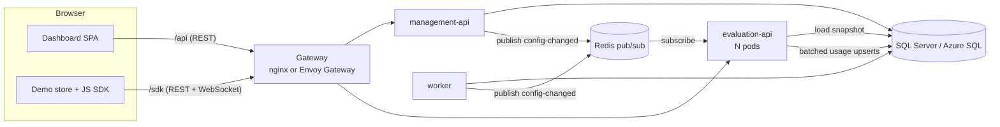
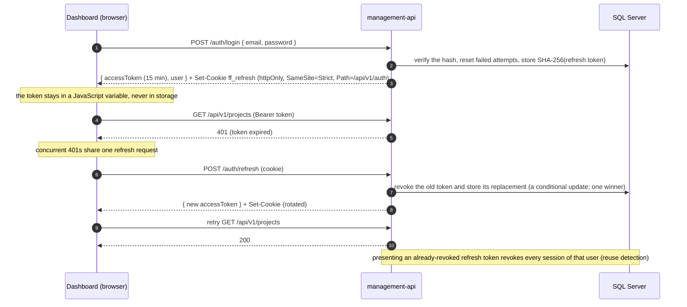
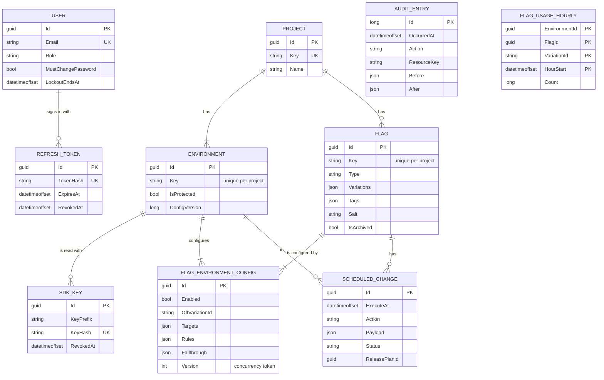

# Architecture

FlagForge is a feature-flag service: people change flags in a dashboard, applications read them through an SDK, and a
change reaches running applications in about a second without a deploy. It runs the same way in Docker Compose, on a
local kind cluster, and on AKS.

## Components

| Component | Kind | Responsibility |
|---|---|---|
| `management-api` | ASP.NET Core minimal API | The dashboard's backend: sign-in, users, projects, environments, flags, targeting, SDK keys, schedules, audit, usage queries, and the targeting preview. Publishes change notifications. |
| `evaluation-api` | ASP.NET Core minimal API | Serves SDKs: authenticates SDK keys, evaluates flags from an in-memory snapshot, hosts the SignalR hub, and counts usage. Scales horizontally. |
| `worker` | ASP.NET Core host | Executes scheduled changes (every 15 seconds) and deletes old usage, audit entries, and refresh tokens (hourly). |
| `migrator` | .NET console app | Applies EF Core migrations and seeds data, then exits. A one-shot Compose service and a Kubernetes Job. |
| `dashboard` | React SPA on nginx | The admin UI (MUI, TanStack Query, React Router). |
| `demo` | React SPA on nginx, under `/demo/` | "Acme Coffee", a store that uses the SDK and shows flag changes live. |
| SQL Server | SQL Server 2022 or Azure SQL | The system of record. |
| Redis | Redis 7 | Pub/sub only: configuration changes and SDK key revocations. It stores nothing. |
| Gateway | nginx (Compose) or Envoy Gateway (Kubernetes) | One origin with path routing: `/api/` to the management API, `/sdk/` (including WebSockets) to the evaluation API, `/demo/` to the demo, and `/` to the dashboard. No path is rewritten. |

The backend is one solution with a strict dependency direction ([ADR 0001](decisions/0001-minimal-apis-layered-solution.md)):

```
FlagForge.Evaluation      pure evaluation engine and targeting validator (no dependencies)
  <- FlagForge.Domain     entities, enums, key rules
  <- FlagForge.Application   use cases, request validation, interfaces (IChangeNotifier, IAuditWriter, ...)
  <- FlagForge.Infrastructure   EF Core, SQL, Redis
  <- ManagementApi, EvaluationApi, Worker, Migrator (plus ServiceDefaults for telemetry, health, and errors)
```



## Change propagation

The core flow: a saved change reaches every connected SDK in about a second.

```mermaid
sequenceDiagram
  autonumber
  participant U as Dashboard
  participant M as management-api
  participant DB as SQL Server
  participant R as Redis
  participant E as evaluation-api (each pod)
  participant C as SDK client

  U->>M: PUT targeting { config, expectedVersion, comment }
  M->>DB: BEGIN
  M->>DB: check Version = expectedVersion (else 409 with currentVersion)
  M->>DB: save config, Version + 1
  M->>DB: UPDATE Environment SET ConfigVersion += 1 OUTPUT new value
  M->>DB: write the audit entry
  M->>DB: COMMIT
  M-->>U: 200 saved config
  M->>R: PUBLISH flagforge:config-changed { environmentId, configVersion }
  Note over M,R: after commit; a failed publish is logged, and the snapshot TTL heals it
  R-->>E: message (every pod subscribes)
  E->>E: evict the environment's snapshot
  E-->>C: FlagsChanged { environmentVersion } to group env:{id} on this pod
  C->>C: wait 250 ms for more notifications
  C->>E: POST /sdk/v1/evaluate { context }
  E->>DB: load and compile a fresh snapshot (single flight)
  E-->>C: every flag's value, variation, and reason
  C->>C: diff values, emit "change" for the keys that changed
```

- Anything that changes evaluation output bumps `ConfigVersion` and publishes: targeting saves, toggles, archive,
  restore, and delete, variation value changes (every environment of the project), environment deletion, and
  executed scheduled changes. SDK key revocation publishes to `flagforge:sdk-key-revoked`, which clears the key caches.
- Redis pub/sub is fire-and-forget, so there is no outbox ([ADR 0003](decisions/0003-redis-pubsub-with-snapshot-ttl.md)).
  Two safety nets make a lost message heal itself: snapshots expire after 60 seconds, and a pod that reconnects to Redis
  evicts every snapshot and tells its own clients to refetch. A pod that starts before Redis accepts connections (pods
  and Redis often start together) registers its handlers anyway; the client subscribes them on the first connection,
  which triggers the same resynchronization.
- Every evaluation pod receives every message and notifies only its own WebSocket clients, so SignalR needs no
  backplane and connections need no sticky sessions ([ADR 0004](decisions/0004-signalr-without-backplane.md)).

## Evaluation path

- **SDK key authentication:** the key is hashed (SHA-256) and looked up in a 60-second in-memory cache, then in the
  database. Plaintext keys are never stored or logged ([ADR 0010](decisions/0010-sdk-keys-public-identifiers.md)).
- **Snapshot cache:** one compiled snapshot per environment, loaded once even when many requests arrive together.
  Target lists are hash sets, numeric values are pre-parsed, and variations are indexed, so a request does no parsing.
- **Usage:** each served result increments an in-memory counter keyed by environment, flag, variation, and hour. Every
  30 seconds, and on shutdown after in-flight requests finish, the counters are upserted with batched `MERGE`
  statements in one transaction, so a retried flush never double counts.
- **Rate limiting:** a token bucket per SDK key (20 per second, burst 100).

## Sign-in and token refresh

The access token lives only in memory; a rotating httpOnly cookie restores sessions
([ADR 0008](decisions/0008-in-memory-access-token-refresh-cookie.md)).



On page load the dashboard calls `/auth/refresh` first, so a reload keeps the session without storing a token. Sign-in
is rate limited per client IP and locks an account for 15 minutes after five failures, with one generic error message.

## Scheduled changes

The worker claims due changes with `UPDATE TOP (n) ... WITH (ROWLOCK, READPAST) OUTPUT ...`, which lets several worker
replicas share the queue without taking the same rows. A claim lasts five minutes. Executing a change first flips its
own claim from `Processing` to `Completed` in the same transaction that applies the change, so a change runs exactly
once even if a claim expires, and a change waits while an earlier change for the same flag and environment is still
open, so release-plan steps apply in order. Changes are applied through the same application services the API uses,
as the system actor, with the same validation and audit entries.

## Data model



- Keys are UUIDv7 (`AuditEntry` uses a `long` identity). Timestamps are UTC `DateTimeOffset` from an injected
  `TimeProvider`.
- Variations, tags, targets, rules, serves, schedule payloads, and audit snapshots are JSON columns written with the
  API's own JSON options, so what is stored has exactly the API's shape ([ADR 0005](decisions/0005-targeting-as-json-columns.md)).
- `AUDIT_ENTRY` and `FLAG_USAGE_HOURLY` have no foreign keys on purpose: the history must outlive what it describes, and
  a usage flush must never fail because a flag was deleted in between.
- A config row exists for every flag in every environment; creating a flag or an environment creates the missing rows.

## Container and cluster security

- **Images:** the .NET services run on Microsoft's chiseled `-extra` images: distroless, no shell or package manager,
  non-root by default. The `-extra` variant adds ICU, which `Microsoft.Data.SqlClient` requires. The images are
  published for the target architecture, so they carry only Linux native libraries. The dashboard and demo run on
  `nginx-unprivileged` (non-root, port 8080). Chiseled images have no `curl`, so Compose has no `HEALTHCHECK` for them;
  Kubernetes probes and the smoke test check health instead.
- **Pods** run as non-root with the `RuntimeDefault` seccomp profile, no privilege escalation, and all capabilities
  dropped. SQL Server adds back `NET_BIND_SERVICE` only, because its binary carries that file capability and the kernel
  refuses to start it otherwise; with privilege escalation off it never actually gains it.
- **Read-only root filesystems** for the .NET containers and Redis, with an `emptyDir` for `/tmp` (and Redis's `/data`).
  The nginx containers keep a writable root filesystem because the image's entrypoint renders its configuration
  templates at startup (the demo's SDK key comes from an environment variable that way).
- **Secrets** are never in the repository. Compose uses development defaults (overridable with `.env`), and Kubernetes
  reads the Secret `flagforge-secrets`, which the deploy scripts and workflows create. GitHub Actions signs in to Azure
  with OpenID Connect, so no Azure credential is stored ([ADR 0009](decisions/0009-github-oidc-to-azure.md)).
- **Network edges:** only the gateway is published. Health endpoints are not routed through it, and the management API
  trusts forwarded headers because it is reachable only through the gateway.

## Observability

`FlagForge.ServiceDefaults` wires every service the same way: OpenTelemetry traces and metrics (ASP.NET Core,
HttpClient, SQL client, runtime, and the `FlagForge.Evaluation` meter), exported over OTLP only when
`OTEL_EXPORTER_OTLP_ENDPOINT` is set; JSON console logs outside development; `/health/live` (process) and
`/health/ready` (SQL reachable with no pending migrations, cached for 30 seconds; Redis reported as degraded so a Redis
outage does not take pods out of rotation). Compose's `observability` profile runs the Aspire dashboard to look at
traces locally.

## Deployment shapes

| | Compose | kind | AKS |
|---|---|---|---|
| Gateway | nginx container on port 8080 | Envoy Gateway, NodePort 30080 mapped to port 8090 | Envoy Gateway with a public LoadBalancer IP |
| SQL | SQL Server container | In-namespace StatefulSet (`ephemeral-sql`) | Azure SQL, serverless |
| Replicas | 1 each | 1 each | 2 each, evaluation API autoscaled 2 to 6 |
| Guide | README | [local-kubernetes.md](local-kubernetes.md) | [azure-setup.md](azure-setup.md) |
